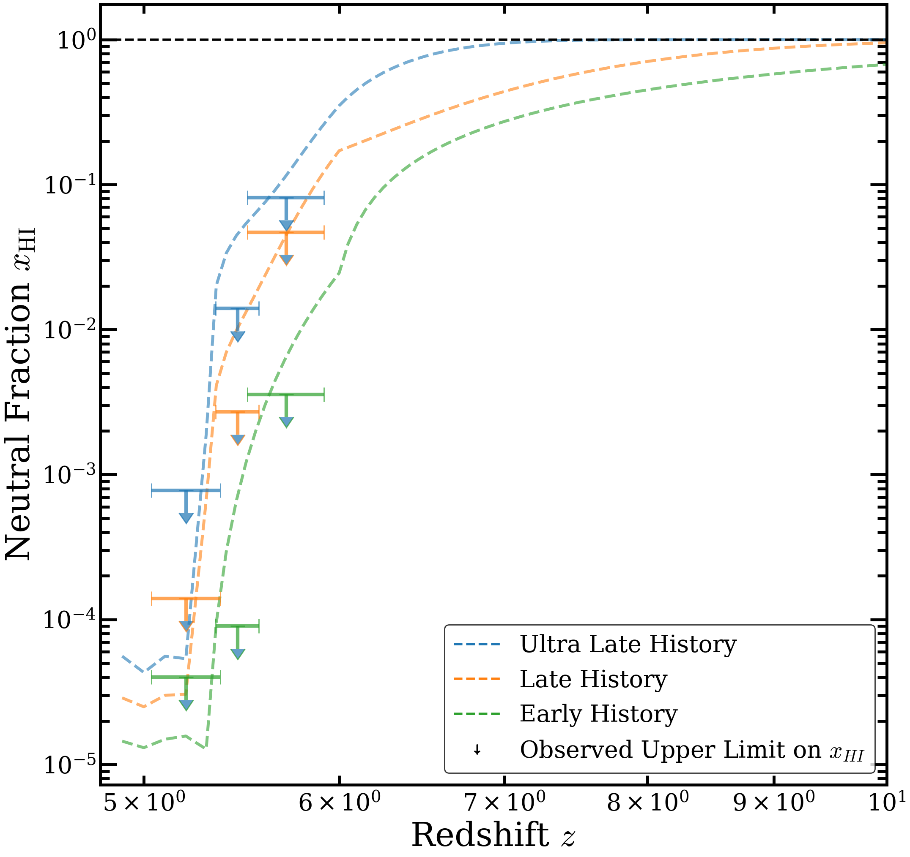

# Dark Gap Statistics in the Lyman-α Forest

This repository presents a computational pipeline to study the **ionization state of the intergalactic medium (IGM)** at high redshifts ($5.0 < z < 6.0$) using **dark gap statistics** in quasar absorption spectra.

The analysis is based on synthetic sightlines generated from **EX-CITE radiative transfer simulations** (Gaikwad et al. 2023), and is designed to compare theoretical models of reionization with observational constraints (e.g., Zhu et al. 2021).

---

## Scientific Motivation

At redshifts $z \sim 5$–6, the Universe undergoes the final stages of **cosmic reionization**, where neutral hydrogen becomes ionized due to radiation from early sources.

Traditional probes based on mean transmission become insensitive in this regime due to saturation ($F \approx 0$).
**Dark gap statistics** provide an alternative approach by focusing on contiguous regions of near-zero flux, which are sensitive to:

* Neutral hydrogen fraction
* Fluctuations in the photoionization rate $\langle \Gamma_{\mathrm{HI}} \rangle$
* The topology of reionization

---

## Methodology Overview

The pipeline consists of the following steps:

```text id="9ny0hd"
Simulated Sightlines → Optical Depth → Flux → Dark Gap Identification 
→ Statistical Analysis (CDF, F10, PDF) → χ² Minimization → Physical Constraints
```

### Key Features

* Dark gap identification using observationally motivated criteria ($F < 0.05$)
* Multi-model comparison (Early, Late, Ultra-Late reionization scenarios)
* Statistical tools:

  * CDF of gap lengths
  * $F_{10}$ statistic
  * PDF via kernel density estimation (KDE)
* Parameter inference via $\chi^2$ minimization
* Independent estimation of **mean free path ($\lambda_{\mathrm{mfp}}$)**

---
## Constraint Plot obtained from Dark Gap Statistics



---

## Repository Structure

```text id="n2t2fm"
.
├── scripts/        # Core analysis pipeline
├── data/           # Dark gap catalogs / sample data
├── results/        # Plots and statistical outputs
├── requirements.txt
└── README.md
```

---

## Getting Started

### 1. Install dependencies

```bash id="xfy6c1"
pip install -r requirements.txt
```

### 2. Run the pipeline

```text id="g7x9z3"
1. Generate optical depth (if applicable)
2. Identify dark gaps
3. Compute statistics (CDF, F10, PDF)
4. Perform χ² analysis
5. Estimate mean free path
```

See `scripts/README.md` for detailed execution steps.

---

## Data

* The analysis uses synthetic spectra from EX-CITE simulations.
* Due to collaboration constraints, full simulation datasets are not included.
* Sample dark gap data are provided for demonstration.

See `data/README.md` for details.

---

## Results

The repository produces:

* Dark gap length distributions
* CDF comparisons with observations
* $F_{10}$ statistics
* PDF-based $\chi^2$ constraints
* Mean free path estimates

See `results/README.md` for a detailed description.

---

## Notes on Reproducibility

* Some scripts depend on private modules used for simulation data handling.
* The analysis pipeline itself is fully modular and can be applied to any compatible dataset.
* MPI-based scripts require a parallel computing environment.

---

## Summary

This project provides a **modular and reproducible framework** for studying the high-redshift IGM using dark gap statistics, bridging:

* Cosmological simulations
* Observational constraints
* Statistical inference

---

## Acknowledgements

This work is based on simulations and methodologies developed in collaboration with ongoing research efforts in Lyman-α forest studies and reionization modeling.

---
## Author
Manpreet — MSc Astrophysics, IIT Indore
